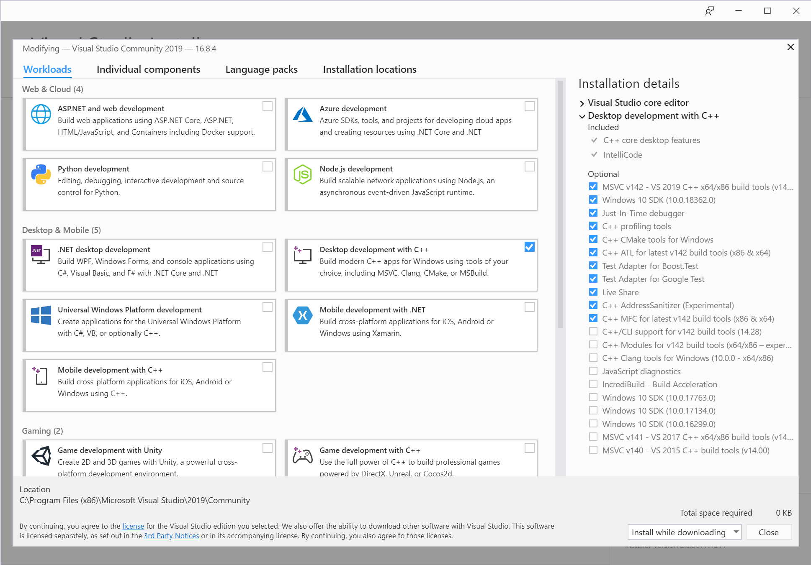

Using CMake to compile T3000
============================

We have setup CI using CMake and github actions. This document explains compilation running locally on your machine.

Prerequisites
-------------
T3000 uses MFC, so make sure you have MFC installed within Visual Studio. If you are working with version above Visual Studio 2017, CMake comes bundled with it. If not, please install [CMake](https://cmake.org/)

Specific instructions for Visual Studio 2019 on Windows 10 are:
* Download the Community edition of [Visual Studio 2019](https://visualstudio.microsoft.com/downloads/) installer (make sure you are covered by its licence terms).
* Run the installer and select:
	* Desktop development with C++
	* C++ MFC for latest 142 build tools (x86 & x64)

Launching a Build
-----------------------------------------------------------
* Checkout T3000
* Open a Developer Command Prompt for VS (Visual Studio 2019 nomenclature, others may vary)
* Switch to the folder T3000_Building_Automation_System\build
* Run _Build.bat or Issue the commands:
   * cmake -A Win32 .. -DCMAKE_TOOLCHAIN_FILE="..\vcpkg-export-openssl\scripts\buildsystems\vcpkg.cmake" 
   * cmake --build .
   
Debugging with VS
-----------------------------------------------------------
* Follow the Launching a Build instructions
* Run _Debug.bat or Issue the command:
   * cmake --open .

What to do if CI or local build fails with a build error
-----------------------------------------------------------
* If the above fails this is mostly due to:
   * Compilation errors in one or more CPP files
   * Developer _forgot_ to add new files to CMakeLists.txt

